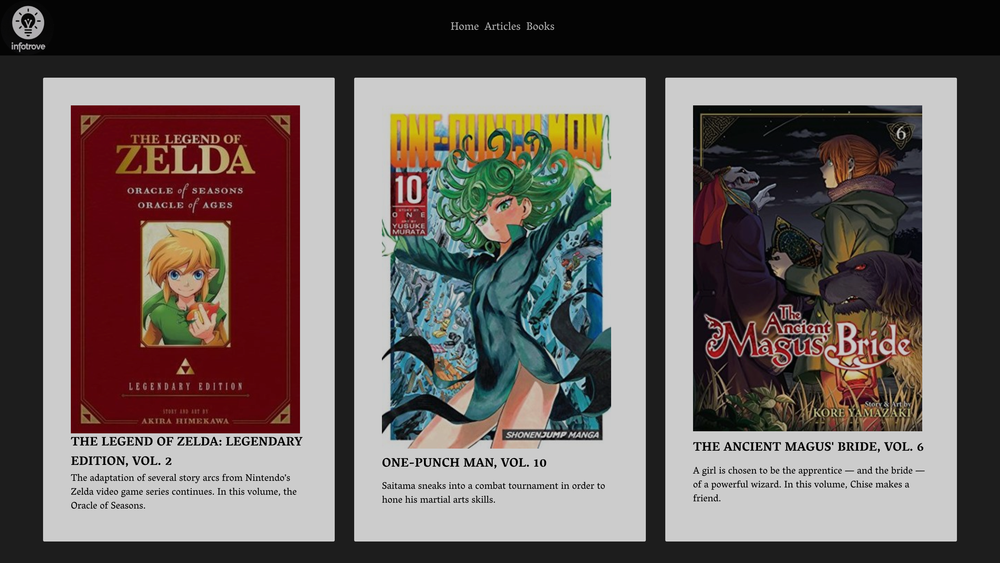
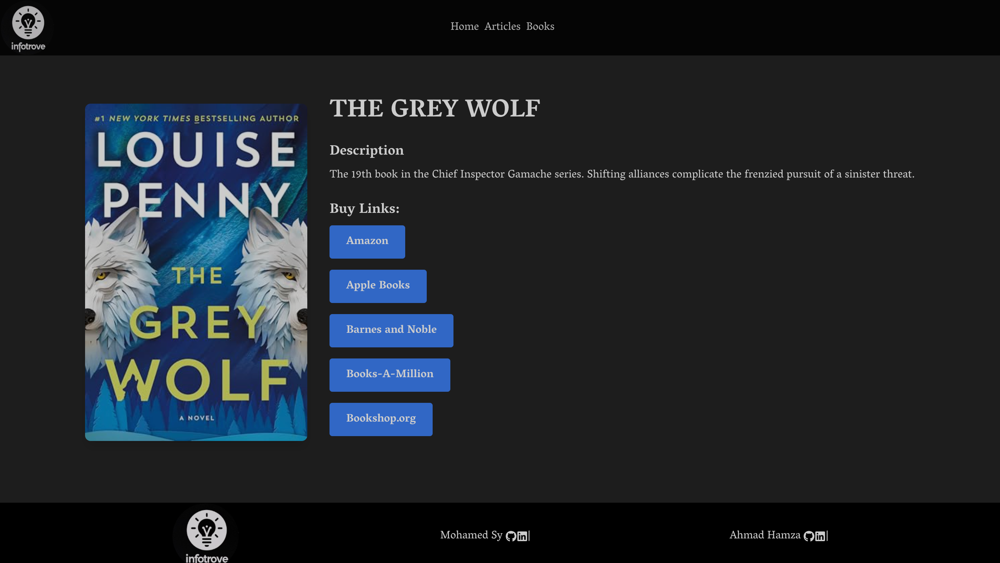

# InfoTrove

InfoTrove is an interactive web application designed to provide users with easy access to articles, books, and top stories. This application leverages a GraphQL API to fetch data from The New York Times and utilizes Apollo Client for efficient data management and caching. Users can explore various topics, view top stories, and access in-depth information about books and articles through a visually engaging and responsive interface.

## Deployed URL

You can access the live version of InfoTrove at the following URL:

[InfoTrove Live](https://info-trove.vercel.app/)

Enjoy exploring the latest articles, books, and top stories!

## Table of Contents

- [Features](#features)
- [Tech Stack](#tech-stack)
- [Installation](#installation)
- [Usage](#usage)
- [Components Overview](#components-overview)
- [Screenshots](#screenshots)
- [Contributing](#contributing)

## Features

- **Explore Articles and Books**: Search and browse articles by section and books by category, all fetched dynamically from the NYT's API using GraphQL.
- **Top Stories Section**: View the latest top stories with smooth horizontal scrolling and visual indicators.
- **Detailed Book Views**: Access comprehensive details about books, including descriptions and links for purchase.
- **Responsive Design**: Optimized for desktop and mobile, with dropdown menus and animated transitions.
- **Real-Time Loading Indicators**: Custom loading animations provide feedback during data fetching.
- **Scroll Progress Indicators**: Visual progress bars guide users as they scroll through stories and book details.

## Tech Stack

- **Frontend**: React, Tailwind CSS, Framer Motion for animations
- **Backend**: Apollo Server, Node.js, GraphQL
- **State Management**: Apollo Client (with caching)
- **Routing**: React Router
- **Deployment**: Vercel

## Installation

1. **Clone the repository**:

```bash
git clone https://github.com/your-username/InfoTrove.git
cd InfoTrove
```

2. **Create local.env file in the root and set up environment variables**:

```bash
NYT_API_KEY_ARTICLES=your_article_api_key
NYT_API_KEY_BOOKS=your_books_api_key
NYT_API_KEY_TOP_STORIES=your_top_stories_api_key
```

3. **Install dependencies**:

```bash
npm install
```

4. **Start development server**:

```bash
npm run dev
```

## Usage

- **Navigation**:
  - **Home**: View the latest top stories in a horizontally scrollable section, with real-time progress indicators.
  - **Articles**: Hover over the "Articles" dropdown to select sections like Science, Technology, Health, and Travel.
  - **Books**: Hover over the "Books" dropdown to explore categories such as Fiction, Nonfiction, Sports, and more.
  - **Details**: Click on a book or article to view detailed information, including a description and links to buy or read.

## Screenshots






## Components Overview

1. **NavBar**:

- The main navigation component.
- Dropdown menus for Articles and Books sections, fetching data via GraphQL on selection.

2. **TopStories**:

- Displays top stories in a scrollable horizontal layout.
- Includes a custom scroll indicator to track user position.
- Gradient indicators on edges guide users to scroll for more content.

3. **BookDetail**:

- Shows detailed information about a selected book, including title, description, author, and buy links.
- Fetches data from Apollo Client’s cache or requests it if unavailable.
- Incorporates responsive design for optimal viewing on mobile devices.

4. **Footer**:

- Provides links back to the top and information about the application.

## Future Enhancements

- **User Authentication**: Allow users to create accounts, save favorite articles, and receive personalized recommendations.
- **Enhanced Filtering**: Add more filtering options for articles and books, such as by date or author.
- **User Comments and Reviews**: Enable users to leave reviews on books and articles.
- **Improved Mobile Experience**: Further refine mobile responsiveness, especially for scrollable sections.

## Contributing

We welcome contributions! To contribute:

1. Fork the repository.
2. Create a new branch (`git checkout -b feature/YourFeature`).
3. Make your changes and commit them (`git commit -m 'Add your feature'`).
4. Push to the branch (`git push origin feature/YourFeature`).
5. Open a pull request.

Feel free to reach out for questions or feedback. Thank You!
